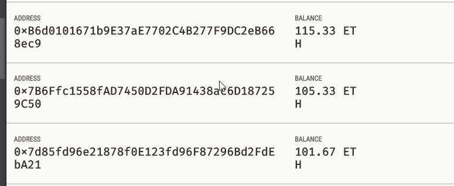

Your new startup has created its own Ethereum-compatible blockchain to help connect financial institutions, and the team wants to build smart contracts to automate some company finances to make everyone's lives easier, increase transparency, and to make accounting and auditing practically automatic!
Fortunately, you've been learning how to program smart contracts with Solidity! What you will be doing this assignment is creating 3 ProfitSplitter contracts. These contracts will do several things:

# AssociateProfitSplitter
* [AssociateProfitSplitter.sol](AssociateProfitSplitter.sol)
#####  This will accept Ether into the contract and divide the Ether evenly among the associate level employees. This will allow the Human Resources department to pay employees quickly and efficiently.

Deploy:

Checking the balance before the execution:

After the deploy:

Doing the deposit:

The new balance for each account:

# TieredProfitSplitter
* [TieredProfitSplitter.sol](TieredProfitSplitter.sol)
#####  That will distribute different percentages of incoming Ether to employees at different tiers/levels. For example, the CEO gets paid 60%, CTO 25%, and Bob gets 15%.

Deploy:

The balance before the deposit:

Doing the deposit: 

Checking the reminder:

Checking the new balance:

# DeferredEquityPlan
* [DeferredEquityPlan.sol](DeferredEquityPlan.sol)
#####  It is a traditional company stock plans model. This contract will automatically manage 1000 shares with an annual distribution of 250 over 4 years for a single employee.

Deploy:

As the unlock date is greater than the current date, We'll not be able to perform the "distribution". If we try , we'll get an error message ("Shares are not vested yet") as shown below:

In order to demonstrate how the distribution works, there's a way to push the current date to be greater than the unlock time. For each time we click in "Fast Forward", We're adding 1 year to the "fake now":

Checking the distributed shares and if everything is good, you should see 1000:

